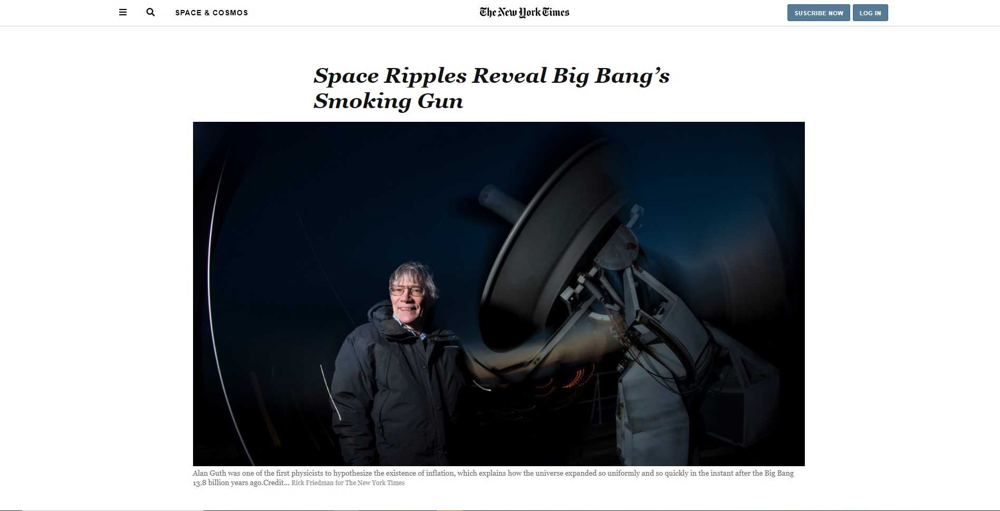

# New York Times clone page

> This project is made as part of Microverse HTML/CSS curriculum

## Sample of New York Times Clone with the following features:

- Sticky Navigation Bar
- Aside with Editor's Pick
- Floating Elements and Positioning
- Grids and flexbox

## Built With

- HTML
- CSS/SCSS

## Live Demo

[Live Demo Link](https://rawcdn.githack.com/helciodev/nytClone/ed29202bf1f1f364f754ec8569dc235ba17946cc/index.html)

**See the page via the link above**

**See the Source Page via the link below**

[Source Page Link](https://www.nytimes.com/2014/03/18/science/space/detection-of-waves-in-space-buttresses-landmark-theory-of-big-bang.html?_r=0)

## Authors

😎 **Helcio André**

- GitHub: [@helciodev](https://github.com/helciodev)
- Twitter: [@helcio_bruno](https://twitter.com/helcio_bruno)

👤 **Alan Solis**

- GitHub: [@github](https://github.com/warblo001)
- Twitter: [@twitter](https://twitter.com/Alan55572391)
- LinkedIn: [LinkedIn](https://www.linkedin.com/in/alan-solis-b567b044/)

## Show your support

Give a ⭐️ if you like this project!

## 📝 License

This project is [MIT](./license.txt) licensed.
